<div align="center">

# 💊 PharmaCare — Pharmacy Management System

**A full-featured, layered-architecture pharmacy management system built with ASP.NET Core.**
Manage medicines, batches, purchases, sales (POS), returns, shifts, expenses, and financial reporting — with FEFO-aware stock control and a JWT-secured Web API.

[](https://dotnet.microsoft.com/)
[](https://learn.microsoft.com/en-us/dotnet/csharp/)
[](https://learn.microsoft.com/en-us/ef/core/)
[](https://www.microsoft.com/en-us/sql-server)
[](https://swagger.io/)
[](#-license)

</div>

---

## 📑 Table of Contents


- [About the Project](#-about-the-project)
- [Screenshots](#-screenshots)
- [Key Features](#-key-features)
- [Tech Stack](#-tech-stack)
- [Architecture](#-architecture)
- [Project Structure](#-project-structure)
- [Getting Started](#-getting-started)
  - [Prerequisites](#prerequisites)
  - [Installation](#installation)
  - [Default Login](#default-login)
- [Running the Web API](#-running-the-web-api)
- [User Roles & Permissions](#-user-roles--permissions)
- [Core Modules](#-core-modules)
- [Roadmap](#-roadmap)
- [Contributing](#-contributing)
- [License](#-license)
- [Contact](#-contact)

---

## 📖 About the Project

**PharmaCare** is a real-world pharmacy management system designed to handle the day-to-day operations of a pharmacy: inventory with expiry-batch tracking, point-of-sale, purchase orders, supplier/customer returns, cashier shift reconciliation, expense tracking, and financial reporting (COGS, gross profit, net profit).

The solution ships as **two front doors over one shared business core**:

- **`Pharmacy`** — a server-rendered ASP.NET Core MVC app (AdminLTE UI) for day-to-day staff use.
- **`PharmacyAPI`** — a JWT-secured ASP.NET Core Web API exposing the same business logic via REST endpoints, documented with Swagger/OpenAPI, for integrations, mobile apps, or third-party clients.

Both apps sit on top of the same layered core (`PharmacyDAL` → `PharmacyBL`), so business rules — like FEFO stock deduction — are written once and enforced everywhere.

---

## 🖼 Screenshots

### Authentication & Dashboard

<table>
<tr>
<td width="50%">

**Login**
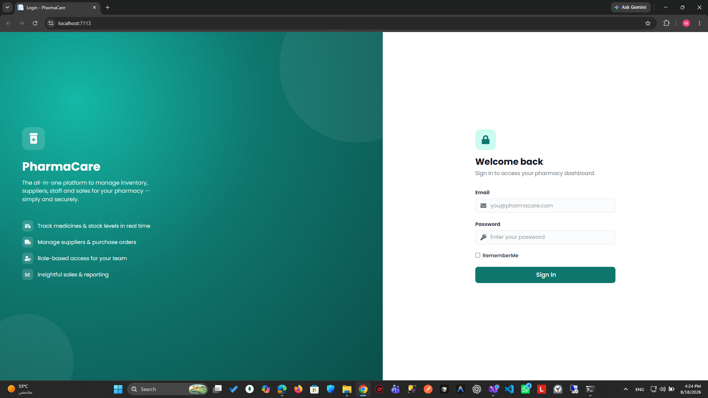

</td>
<td width="50%">

**Admin Dashboard**
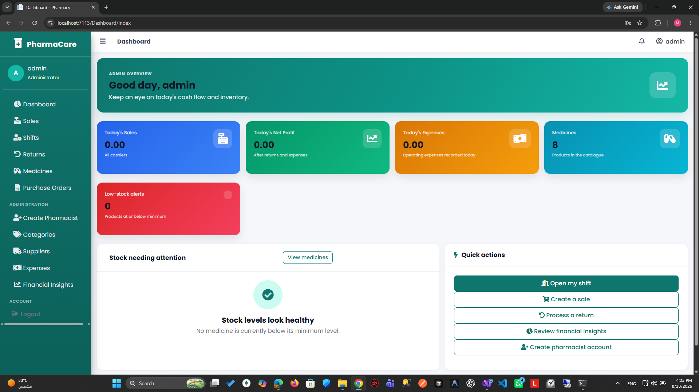

</td>
</tr>
</table>

### Sales (Point of Sale)

<table>
<tr>
<td width="50%">

**Sales Invoices**
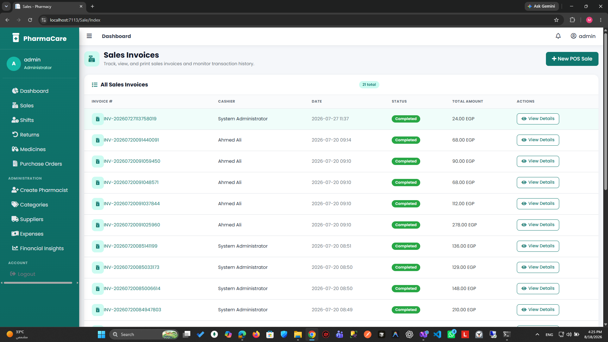

</td>
<td width="50%">

**New POS Sale (FEFO deduction)**
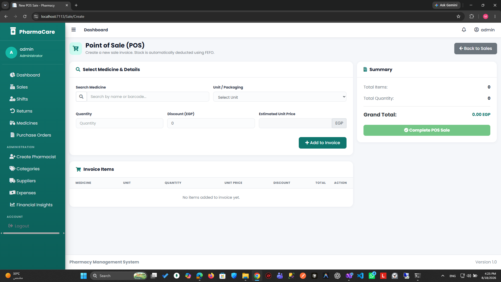

</td>
</tr>
<tr>
<td width="50%">

**Invoice Receipt**
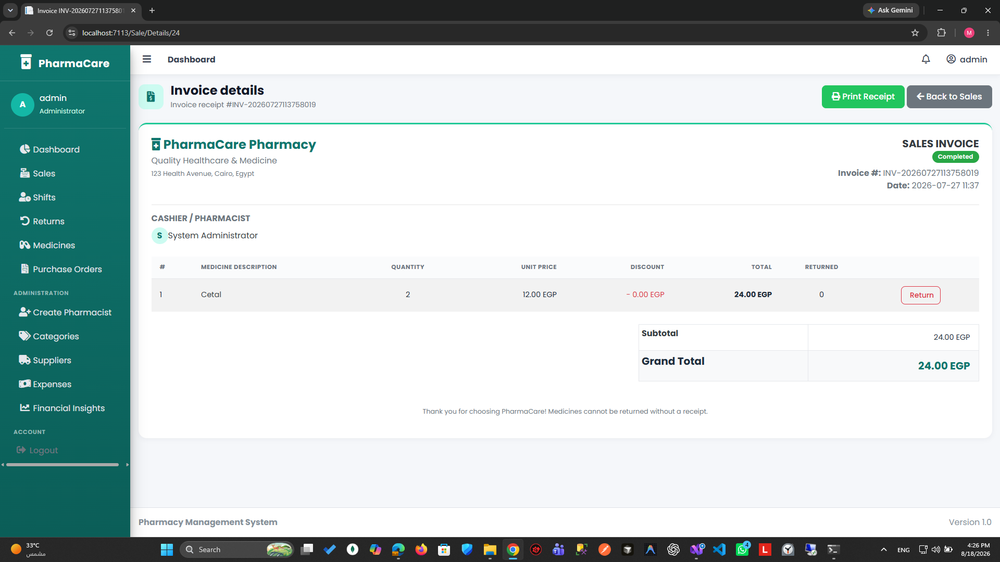

</td>
<td width="50%">

**Shift Management**
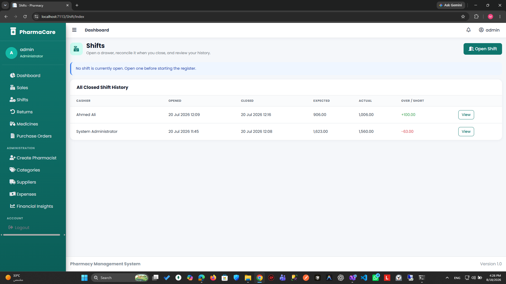

</td>
</tr>
</table>

### Inventory & Medicines

<table>
<tr>
<td width="50%">

**Medicines Catalog**
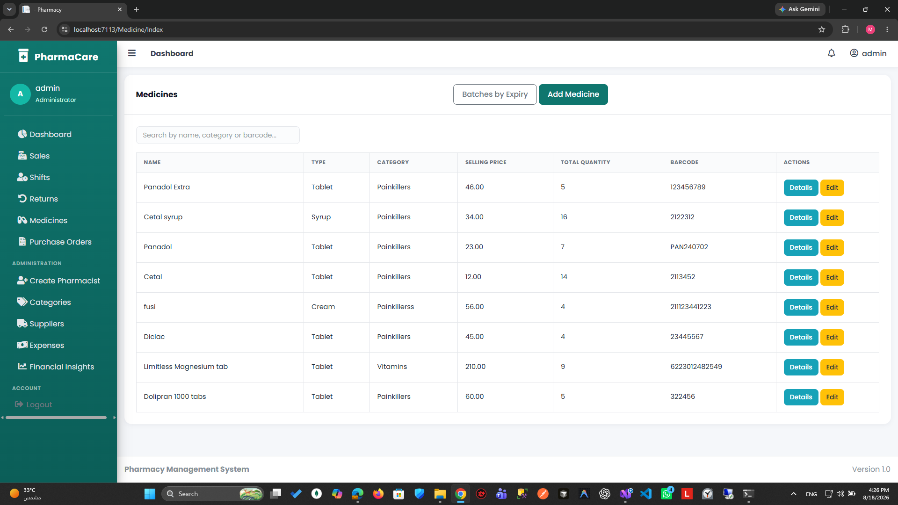

</td>
<td width="50%">

**Add Medicine**
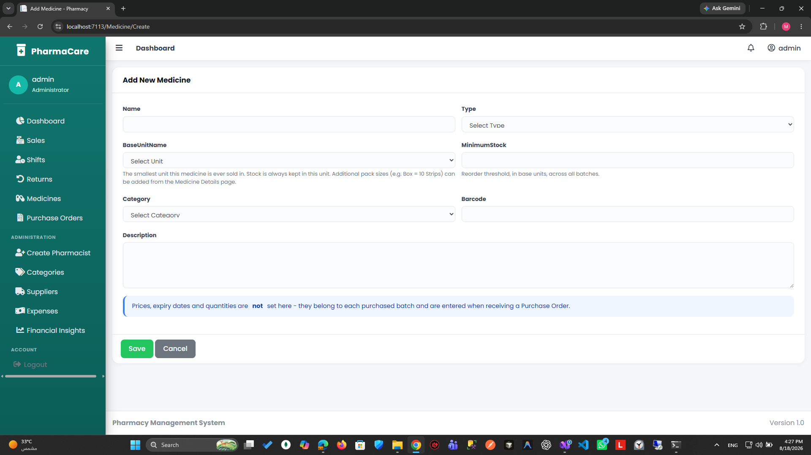

</td>
</tr>
<tr>
<td width="50%">

**Batch Tracking (FEFO)**
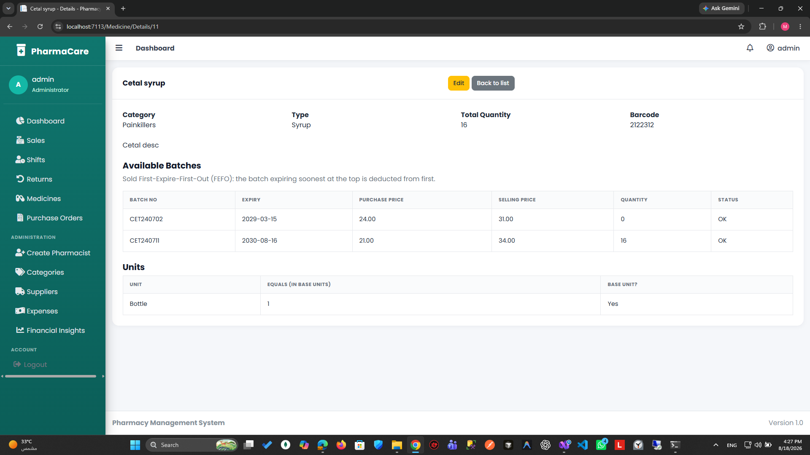

</td>
<td width="50%">

**Returns (Customer & Supplier)**
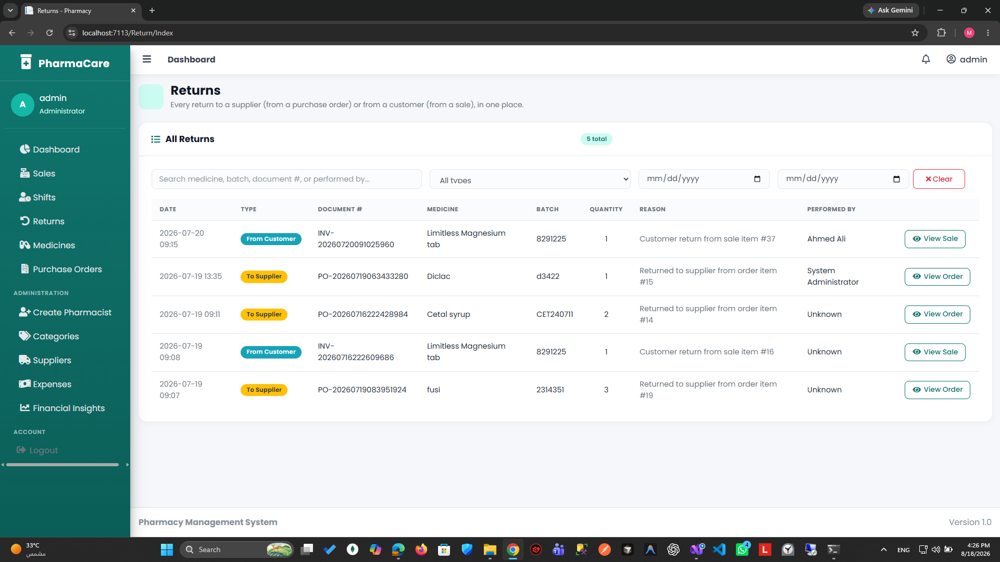

</td>
</tr>
</table>

### Purchasing & Suppliers

<table>
<tr>
<td width="50%">

**Purchase Orders**
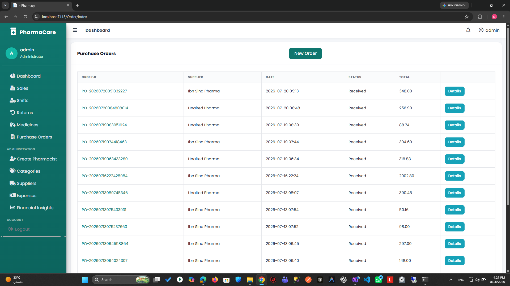

</td>
<td width="50%">

**New Purchase Order**
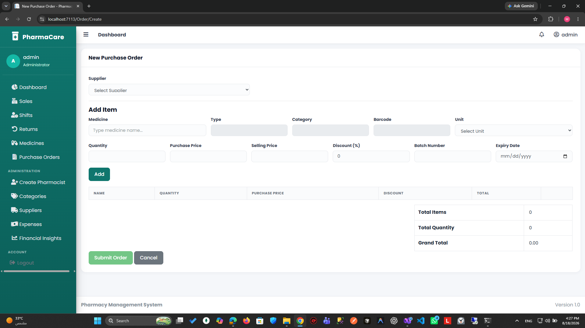

</td>
</tr>
<tr>
<td width="50%">

**Suppliers**
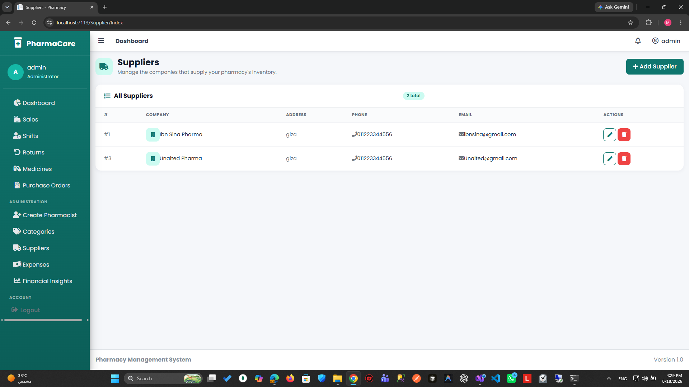

</td>
<td width="50%">

**Categories**
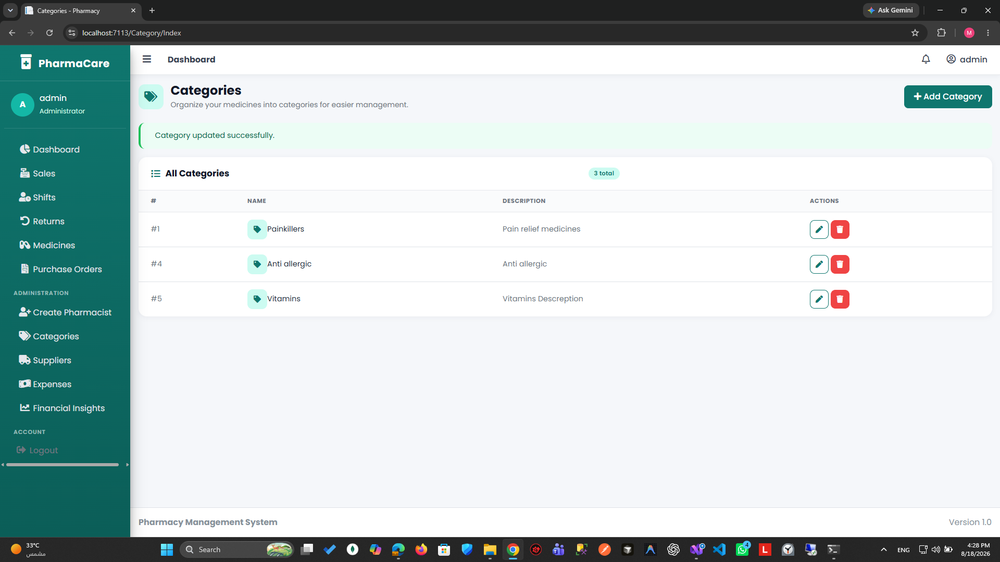

</td>
</tr>
</table>

### Administration & Finance

<table>
<tr>
<td width="50%">

**Create Pharmacist (Role-based Access)**
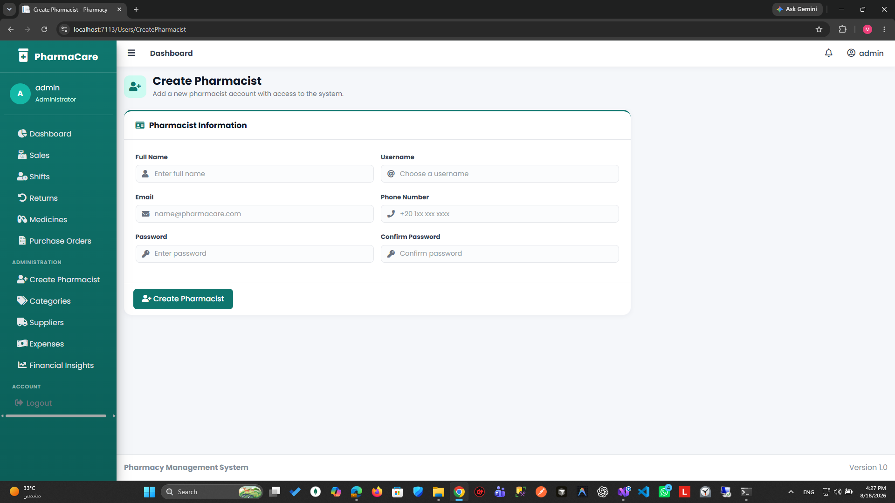

</td>
<td width="50%">

**Expense Tracking**
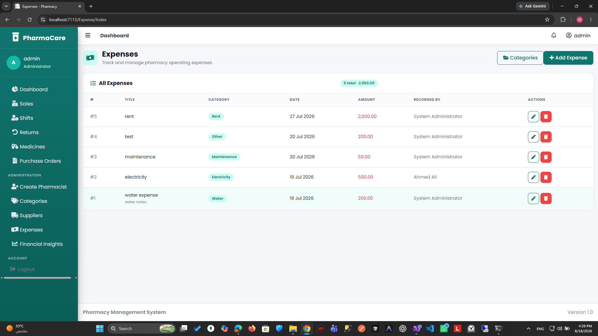

</td>
</tr>
<tr>
<td colspan="2">

**Financial Insights — COGS, Gross/Net Profit, Cash Flow**
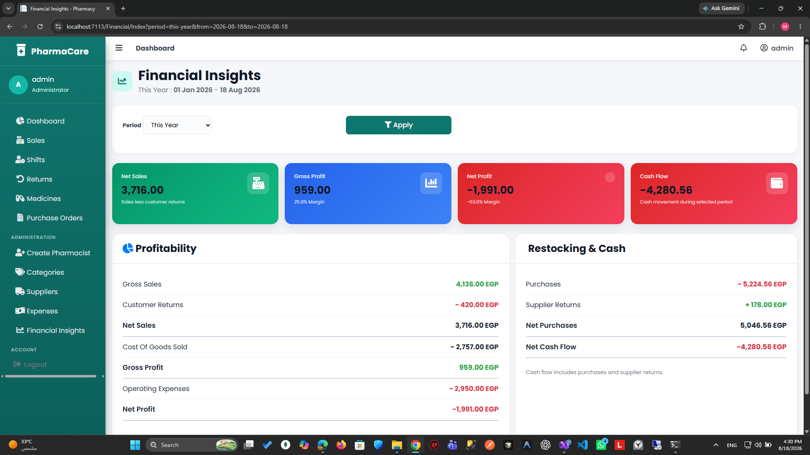

</td>
</tr>
</table>

---

## ✨ Key Features

- 🧾 **Point of Sale (POS)** — fast sale creation with automatic **FEFO** (First-Expire-First-Out) batch deduction, discounts, and printable invoices.
- 📦 **Inventory & Batch Tracking** — medicines with multiple purchasable units (e.g. box → strip), per-batch expiry dates, purchase/selling prices, and minimum-stock alerts.
- 🛒 **Purchase Orders** — record incoming stock from suppliers, auto-create batches, track order status and totals.
- ↩️ **Returns Management** — customer returns (from a sale) and supplier returns (from a purchase order), both fully traced back to the originating batch.
- 🕐 **Shift Management** — cashiers open/close shifts with expected vs. actual cash reconciliation and over/short reporting.
- 💰 **Expense Tracking** — categorized operating expenses (rent, salaries, utilities, etc.).
- 📊 **Financial Insights** — period-based reports for gross sales, customer returns, net sales, COGS, gross profit, operating expenses, net profit, and cash flow.
- 👥 **Role-Based Access Control** — `Admin` and `Pharmacist` roles via ASP.NET Core Identity, with admin-only account creation (no public self-registration).
- 🔐 **Secured Web API** — JWT Bearer authentication, Swagger/OpenAPI documentation, and a controller for every business module.
- 🏗 **Clean, Layered Architecture** — clear separation between data access, business logic, and presentation, shared by both the MVC app and the Web API.

---

## 🛠 Tech Stack

| Layer | Technology |
|---|---|
| **Backend Framework** | ASP.NET Core 8 (MVC + Web API) |
| **Language** | C# 12 |
| **ORM** | Entity Framework Core 8 |
| **Database** | SQL Server (LocalDB by default) |
| **Auth** | ASP.NET Core Identity + JWT Bearer (API) / Cookie Auth (MVC) |
| **API Docs** | Swashbuckle (Swagger / OpenAPI) |
| **Object Mapping** | AutoMapper |
| **Frontend (MVC)** | Razor Views, AdminLTE, Bootstrap, jQuery |
| **Patterns** | Repository, Unit of Work, Service Layer, DTOs |

---

## 🧱 Architecture

The solution follows a **clean, layered architecture** with a shared core consumed by two separate presentation layers:

```
                ┌───────────────────┐        ┌───────────────────┐
                │      Pharmacy      │        │    PharmacyAPI     │
                │   (MVC + AdminLTE) │        │  (JWT + Swagger)   │
                └─────────┬─────────┘        └─────────┬─────────┘
                          │                             │
                          └──────────────┬──────────────┘
                                         │
                                ┌────────▼────────┐
                                │   PharmacyBL     │   Services, DTOs, Validators,
                                │ (Business Logic) │   AutoMapper profiles
                                └────────┬────────┘
                                         │
                                ┌────────▼────────┐
                                │   PharmacyDAL    │   EF Core DbContext, Repositories,
                                │ (Data Access)     │   Unit of Work, Migrations
                                └────────┬────────┘
                                         │
                                ┌────────▼────────┐
                                │   SQL Server     │
                                └──────────────────┘
```

- **`PharmacyDAL`** — EF Core `DbContext`, entity configurations, repositories, and the Unit of Work pattern.
- **`PharmacyBL`** — services encapsulating business rules (e.g., FEFO deduction, financial calculations), DTOs, validators, and AutoMapper mappings.
- **`Pharmacy`** — the MVC front end for staff (server-rendered views, session/cookie auth).
- **`PharmacyAPI`** — a stateless REST API over the same business layer, secured with JWT and documented with Swagger.

---

## 📂 Project Structure

```
PharmacyProject/
├── Pharmacy/                 # ASP.NET Core MVC app (staff-facing UI)
│   ├── Controllers/          # Auth, Dashboard, Sale, Order, Return, Shift, Medicine, ...
│   ├── Views/                # Razor views (AdminLTE-themed)
│   ├── ViewModels/
│   └── wwwroot/
│
├── PharmacyAPI/               # ASP.NET Core Web API
│   ├── Auth/                 # JWT configuration
│   ├── Controllers/          # REST controllers mirroring MVC modules
│   └── Program.cs            # JWT + Swagger setup
│
├── PharmacyBL/                # Business Logic Layer
│   ├── Services/              # CategoryService, SaleService, OrderService, ...
│   ├── DTOs/
│   ├── Mapping/                # AutoMapper profiles
│   ├── Validators/
│   └── Helpers/
│
├── PharmacyDAL/                # Data Access Layer
│   ├── Models/                 # Medicine, MedicineBatch, Order, Sale, Shift, ...
│   ├── Configurations/         # EF Core fluent configurations
│   ├── Repositories/
│   ├── UnitOfWork/
│   └── Migrations/
│
└── docs/
    └── screenshots/            # README screenshots
```

---

## 🚀 Getting Started

### Prerequisites

- [.NET 8 SDK](https://dotnet.microsoft.com/download/dotnet/8.0)
- SQL Server or [SQL Server LocalDB](https://learn.microsoft.com/en-us/sql/database-engine/configure-windows/sql-server-express-localdb) (included with Visual Studio)
- Visual Studio 2022 / VS Code / Rider (optional but recommended)

### Installation

1. **Clone the repository**
   ```bash
   git clone https://github.com/0Mohamed-tarek0/Pharmacy-Management-System.git
   cd Pharmacy-Management-System
   ```

2. **Configure the connection string**

   Update `Pharmacy/appsettings.json` (and `PharmacyAPI/appsettings.json` if running the API) if you're not using LocalDB:
   ```json
   "ConnectionStrings": {
     "DefaultConnection": "Server=(localdb)\\mssqllocaldb;Database=PharmacyApp;Trusted_Connection=True;MultipleActiveResultSets=true"
   }
   ```

3. **Apply EF Core migrations**
   ```bash
   cd PharmacyDAL
   dotnet ef database update --startup-project ../Pharmacy
   ```

4. **Run the MVC application**
   ```bash
   cd ../Pharmacy
   dotnet run
   ```
   The app will seed the database with default roles and an admin account on first run, and will be available at `https://localhost:<port>`.

### Default Login

| Field | Value |
|---|---|
| Email | `admin@pharmacy.com` |
| Password | `Admin@123` |

> ⚠️ Change this password immediately in any non-local environment.

---

## 🔌 Running the Web API

```bash
cd PharmacyAPI
dotnet run
```

- Swagger UI is available at `https://localhost:<port>/swagger`.
- Authenticate via `POST /api/Auth/login` to obtain a JWT, then authorize in Swagger with:
  ```
  Bearer <your-token>
  ```
- Every MVC module (Medicines, Categories, Orders, Sales, Returns, Shifts, Expenses, Suppliers, Financial, Users) has a matching REST controller.

---

## 👥 User Roles & Permissions

| Role | Description |
|---|---|
| **Admin** | Full access — manage users/pharmacists, categories, suppliers, medicines, purchase orders, sales, returns, expenses, and financial reports. |
| **Pharmacist** | Operational access — process sales, open/close shifts, handle returns, view medicine stock. |

Accounts are **admin-provisioned only** (via the "Create Pharmacist" screen) — there is no public self-registration, keeping the system closed to authorized staff.

---

## 🧩 Core Modules

| Module | Highlights |
|---|---|
| **Medicines** | Multi-unit packaging (e.g. Box = 10 Strips), categories, barcodes, minimum stock thresholds |
| **Batches** | Per-batch purchase/selling price and expiry date; **FEFO** enforced at sale time |
| **Purchase Orders** | Supplier selection, per-item batch creation, automatic order totals |
| **Sales (POS)** | Barcode/name search, per-line discounts, automatic stock deduction, printable receipts |
| **Returns** | Customer returns (linked to a sale) and supplier returns (linked to a purchase order), both batch-traced |
| **Shifts** | Open/close cash drawer, expected vs. actual reconciliation, over/short tracking |
| **Expenses** | Categorized operating expenses with notes |
| **Financial Insights** | Configurable period reports: gross sales, returns, net sales, COGS, gross/net profit, margins, cash flow |

---

## 🗺 Roadmap

- [ ] Automated tests (unit + integration)
- [ ] CI/CD pipeline (GitHub Actions)
- [ ] Dockerize the solution (API + MVC + SQL Server)
- [ ] Pagination & advanced filtering across list views
- [ ] Refresh-token support for the API
- [ ] Deployment guide (Azure / IIS)

---

## 🤝 Contributing

Contributions are welcome!

1. Fork the repository
2. Create a feature branch (`git checkout -b feature/your-feature`)
3. Commit your changes (`git commit -m "Add your feature"`)
4. Push to the branch (`git push origin feature/your-feature`)
5. Open a Pull Request

---

## 📄 License

Distributed under the MIT License. See `LICENSE` for more information.

---

## 📬 Contact

**Mohamed Tarek**
GitHub: [@0Mohamed-tarek0](https://github.com/0Mohamed-tarek0)
Project: [Pharmacy-Management-System](https://github.com/0Mohamed-tarek0/Pharmacy-Management-System)
